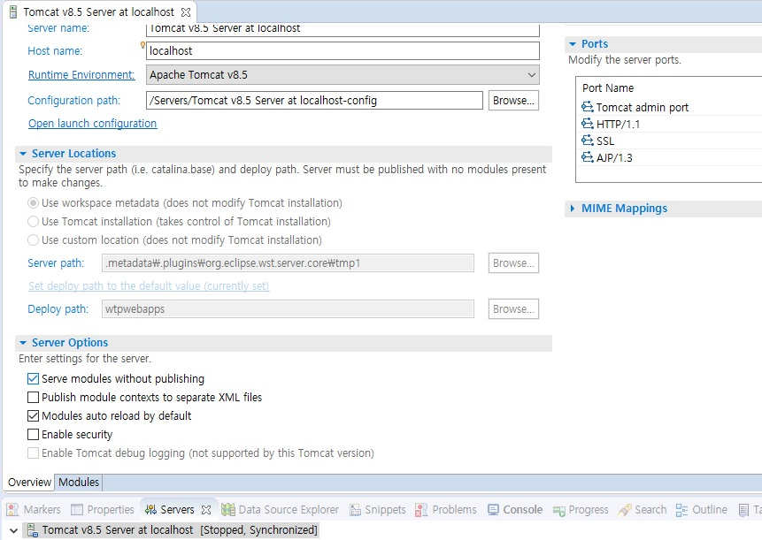

### 이클립스 SERVER 플러그인


이클립스 WTP에 server 플러그인에서 아래 이미지 처럼  serve modules without publshing 설정을 체크 했을때 디플로이가 어떻게 되는지 찾아 보았다.




먼저 이클립스의 workspace 에서 server.xml에 아래 처럼 지정이 된다. 위치는 아래이다.


```

{workspace}\Servers\Tomcat v8.5 Server at localhost-config/server.xml

  <Context docBase="test" path="/test" reloadable="true" source="org.eclipse.jst.jee.server:test"/>

```

위에 설정 처럼 지정이 되는데 이것은 serve modules without publshing 설정을 추가 해도 바뀌지 않는다.
설정을 추가 하면 아래의 경로에 아래 설정이 true로 바뀌고 있었다

```

{workspace}\.metadata\.plugins\org.eclipse.wst.server.core/servers.xml

serveModulesWithoutPublish="true"  

```
그럼 해당 톰캣의 CATALINA_BASE는 어디에 설정되어 있냐면 아래의 xml에 설정이 되어 있다.

```

{workspace}\.metadata\.plugins\org.eclipse.wst.server.core/tmp-data.xml

```

설정된 폴더에 들어가면 톰캣 폴더리스트들이 보이는데 

conf폴더에 server.xml을 보면 아래 처럼 설정이 된다.

```xml

<Context docBase="{workspace}\.metadata\.plugins\org.eclipse.wst.server.core\tmp1\wtpwebapps\ROOT" path="" reloadable="false" />
				<Context docBase="{workspace}\test\src\main\webapp"
					path="/test" reloadable="true" source="org.eclipse.jst.jee.server:test">
					<Resources>
						<PreResources base="{workspace}\test\target\classes"
							classLoaderOnly="false" className="org.apache.catalina.webresources.DirResourceSet"
							internalPath="/" webAppMount="/WEB-INF/classes" />
						<JarResources
							base="{maven_repo}\.m2\repository\commons-beanutils\commons-beanutils\1.8.3\commons-beanutils-1.8.3.jar"
							classLoaderOnly="true" className="org.apache.catalina.webresources.JarResourceSet"
							internalPath="/" webAppMount="/WEB-INF/classes" />
						<JarResources
							base="{maven_repo}\.m2\repository\commons-logging\commons-logging\1.1.1\commons-logging-1.1.1.jar"
							classLoaderOnly="true" className="org.apache.catalina.webresources.JarResourceSet"
							internalPath="/" webAppMount="/WEB-INF/classes" />
						<JarResources
							base="{maven_repo}\.m2\repository\org\mongodb\mongo-java-driver\3.4.1\mongo-java-driver-3.4.1.jar"
							classLoaderOnly="true" className="org.apache.catalina.webresources.JarResourceSet"
							internalPath="/" webAppMount="/WEB-INF/classes" />
						<JarResources
							base="{maven_repo}\.m2\repository\commons-codec\commons-codec\1.10\commons-codec-1.10.jar"
							classLoaderOnly="true" className="org.apache.catalina.webresources.JarResourceSet"
							internalPath="/" webAppMount="/WEB-INF/classes" />
						<JarResources
							base="{maven_repo}\.m2\repository\mysql\mysql-connector-java\5.1.37\mysql-connector-java-5.1.37.jar"
							classLoaderOnly="true" className="org.apache.catalina.webresources.JarResourceSet"
							internalPath="/" webAppMount="/WEB-INF/classes" />
						<JarResources
							base="{maven_repo}\.m2\repository\commons-collections\commons-collections\3.2.1\commons-collections-3.2.1.jar"
							classLoaderOnly="true" className="org.apache.catalina.webresources.JarResourceSet"
							internalPath="/" webAppMount="/WEB-INF/classes" />
						<JarResources
							base="{maven_repo}\.m2\repository\commons-configuration\commons-configuration\1.10\commons-configuration-1.10.jar"
							classLoaderOnly="true" className="org.apache.catalina.webresources.JarResourceSet"
							internalPath="/" webAppMount="/WEB-INF/classes" />
						<JarResources
							base="{maven_repo}\.m2\repository\commons-lang\commons-lang\2.6\commons-lang-2.6.jar"
							classLoaderOnly="true" className="org.apache.catalina.webresources.JarResourceSet"
							internalPath="/" webAppMount="/WEB-INF/classes" />
						<JarResources
							base="{maven_repo}\.m2\repository\commons-dbcp\commons-dbcp\1.3\commons-dbcp-1.3.jar"
							classLoaderOnly="true" className="org.apache.catalina.webresources.JarResourceSet"
							internalPath="/" webAppMount="/WEB-INF/classes" />
						<JarResources
							base="{maven_repo}\.m2\repository\commons-digester\commons-digester\1.7\commons-digester-1.7.jar"
							classLoaderOnly="true" className="org.apache.catalina.webresources.JarResourceSet"
							internalPath="/" webAppMount="/WEB-INF/classes" />
						<JarResources
							base="{maven_repo}\.m2\repository\xml-apis\xml-apis\1.0.b2\xml-apis-1.0.b2.jar"
							classLoaderOnly="true" className="org.apache.catalina.webresources.JarResourceSet"
							internalPath="/" webAppMount="/WEB-INF/classes" />
						<JarResources
							base="{maven_repo}\.m2\repository\joda-time\joda-time\2.7\joda-time-2.7.jar"
							classLoaderOnly="true" className="org.apache.catalina.webresources.JarResourceSet"
							internalPath="/" webAppMount="/WEB-INF/classes" />
						<JarResources
							base="{maven_repo}\.m2\repository\commons-io\commons-io\2.4\commons-io-2.4.jar"
							classLoaderOnly="true" className="org.apache.catalina.webresources.JarResourceSet"
							internalPath="/" webAppMount="/WEB-INF/classes" />
						<JarResources
							base="{maven_repo}\.m2\repository\commons-net\commons-net\3.5\commons-net-3.5.jar"
							classLoaderOnly="true" className="org.apache.catalina.webresources.JarResourceSet"
							internalPath="/" webAppMount="/WEB-INF/classes" />
						<JarResources
							base="{maven_repo}\.m2\repository\org\apache\commons\commons-pool2\2.2\commons-pool2-2.2.jar"
							classLoaderOnly="true" className="org.apache.catalina.webresources.JarResourceSet"
							internalPath="/" webAppMount="/WEB-INF/classes" />
						<JarResources
							base="{maven_repo}\.m2\repository\commons-pool\commons-pool\1.6\commons-pool-1.6.jar"
							classLoaderOnly="true" className="org.apache.catalina.webresources.JarResourceSet"
							internalPath="/" webAppMount="/WEB-INF/classes" />
						<JarResources
							base="{maven_repo}\.m2\repository\commons-validator\commons-validator\1.6\commons-validator-1.6.jar"
							classLoaderOnly="true" className="org.apache.catalina.webresources.JarResourceSet"
							internalPath="/" webAppMount="/WEB-INF/classes" />
						<JarResources
							base="{maven_repo}\.m2\repository\net\sf\ehcache\ehcache\1.3.0\ehcache-1.3.0.jar"
							classLoaderOnly="true" className="org.apache.catalina.webresources.JarResourceSet"
							internalPath="/" webAppMount="/WEB-INF/classes" />
						<JarResources
							base="{maven_repo}\.m2\repository\net\sf\jsr107cache\jsr107cache\1.0\jsr107cache-1.0.jar"
							classLoaderOnly="true" className="org.apache.catalina.webresources.JarResourceSet"
							internalPath="/" webAppMount="/WEB-INF/classes" />
						<JarResources
							base="{maven_repo}\.m2\repository\backport-util-concurrent\backport-util-concurrent\3.0\backport-util-concurrent-3.0.jar"
							classLoaderOnly="true" className="org.apache.catalina.webresources.JarResourceSet"
							internalPath="/" webAppMount="/WEB-INF/classes" />
						<JarResources
							base="{maven_repo}\.m2\repository\net\sf\ezmorph\ezmorph\1.0.6\ezmorph-1.0.6.jar"
							classLoaderOnly="true" className="org.apache.catalina.webresources.JarResourceSet"
							internalPath="/" webAppMount="/WEB-INF/classes" />
						<JarResources
							base="{maven_repo}\.m2\repository\com\maxmind\geoip2\geoip2\2.8.0-rc1\geoip2-2.8.0-rc1.jar"
							classLoaderOnly="true" className="org.apache.catalina.webresources.JarResourceSet"
							internalPath="/" webAppMount="/WEB-INF/classes" />
						<JarResources
							base="{maven_repo}\.m2\repository\org\apache\httpcomponents\httpclient\4.5.2\httpclient-4.5.2.jar"
							classLoaderOnly="true" className="org.apache.catalina.webresources.JarResourceSet"
							internalPath="/" webAppMount="/WEB-INF/classes" />
						<JarResources
							base="{maven_repo}\.m2\repository\org\apache\httpcomponents\httpcore\4.4.4\httpcore-4.4.4.jar"
							classLoaderOnly="true" className="org.apache.catalina.webresources.JarResourceSet"
							internalPath="/" webAppMount="/WEB-INF/classes" />
						<JarResources
							base="{maven_repo}\.m2\repository\com\google\guava\guava\18.0\guava-18.0.jar"
							classLoaderOnly="true" className="org.apache.catalina.webresources.JarResourceSet"
							internalPath="/" webAppMount="/WEB-INF/classes" />
						<JarResources
							base="{maven_repo}\.m2\repository\com\zaxxer\HikariCP\2.6.0\HikariCP-2.6.0.jar"
							classLoaderOnly="true" className="org.apache.catalina.webresources.JarResourceSet"
							internalPath="/" webAppMount="/WEB-INF/classes" />
						<JarResources
							base="{maven_repo}\.m2\repository\org\glassfish\hk2\hk2-api\2.4.0-b25\hk2-api-2.4.0-b25.jar"
							classLoaderOnly="true" className="org.apache.catalina.webresources.JarResourceSet"
							internalPath="/" webAppMount="/WEB-INF/classes" />
						<JarResources
							base="{maven_repo}\.m2\repository\org\glassfish\hk2\external\aopalliance-repackaged\2.4.0-b25\aopalliance-repackaged-2.4.0-b25.jar"
							classLoaderOnly="true" className="org.apache.catalina.webresources.JarResourceSet"
							internalPath="/" webAppMount="/WEB-INF/classes" />
						<JarResources
							base="{maven_repo}\.m2\repository\org\glassfish\hk2\hk2-locator\2.4.0-b25\hk2-locator-2.4.0-b25.jar"
							classLoaderOnly="true" className="org.apache.catalina.webresources.JarResourceSet"
							internalPath="/" webAppMount="/WEB-INF/classes" />
						<JarResources
							base="{maven_repo}\.m2\repository\org\glassfish\hk2\external\javax.inject\2.4.0-b25\javax.inject-2.4.0-b25.jar"
							classLoaderOnly="true" className="org.apache.catalina.webresources.JarResourceSet"
							internalPath="/" webAppMount="/WEB-INF/classes" />
						<JarResources
							base="{maven_repo}\.m2\repository\org\javassist\javassist\3.18.1-GA\javassist-3.18.1-GA.jar"
							classLoaderOnly="true" className="org.apache.catalina.webresources.JarResourceSet"
							internalPath="/" webAppMount="/WEB-INF/classes" />
						<JarResources
							base="{maven_repo}\.m2\repository\org\glassfish\hk2\hk2-utils\2.4.0-b25\hk2-utils-2.4.0-b25.jar"
							classLoaderOnly="true" className="org.apache.catalina.webresources.JarResourceSet"
							internalPath="/" webAppMount="/WEB-INF/classes" />
						<JarResources
							base="{maven_repo}\.m2\repository\org\apache\ibatis\ibatis\2.3.4.726p\ibatis-2.3.4.726p.jar"
							classLoaderOnly="true" className="org.apache.catalina.webresources.JarResourceSet"
							internalPath="/" webAppMount="/WEB-INF/classes" />
						<JarResources
							base="{maven_repo}\.m2\repository\com\hynnet\logback-classic\1.1.3\logback-classic-1.1.3.jar"
							classLoaderOnly="true" className="org.apache.catalina.webresources.JarResourceSet"
							internalPath="/" webAppMount="/WEB-INF/classes" />
						<JarResources
							base="{maven_repo}\.m2\repository\com\hynnet\logback-core\1.1.3\logback-core-1.1.3.jar"
							classLoaderOnly="true" className="org.apache.catalina.webresources.JarResourceSet"
							internalPath="/" webAppMount="/WEB-INF/classes" />
						<JarResources
							base="{maven_repo}\.m2\repository\javax\transaction\jta\1.1\jta-1.1.jar"
							classLoaderOnly="true" className="org.apache.catalina.webresources.JarResourceSet"
							internalPath="/" webAppMount="/WEB-INF/classes" />
						<JarResources
							base="{maven_repo}\.m2\repository\cglib\cglib\2.1_3\cglib-2.1_3.jar"
							classLoaderOnly="true" className="org.apache.catalina.webresources.JarResourceSet"
							internalPath="/" webAppMount="/WEB-INF/classes" />
						<JarResources
							base="{maven_repo}\.m2\repository\asm\asm\1.5.3\asm-1.5.3.jar"
							classLoaderOnly="true" className="org.apache.catalina.webresources.JarResourceSet"
							internalPath="/" webAppMount="/WEB-INF/classes" />
						<JarResources
							base="{maven_repo}\.m2\repository\opensymphony\oscache\2.4\oscache-2.4.jar"
							classLoaderOnly="true" className="org.apache.catalina.webresources.JarResourceSet"
							internalPath="/" webAppMount="/WEB-INF/classes" />
						<JarResources
							base="{maven_repo}\.m2\repository\com\fasterxml\jackson\core\jackson-annotations\2.9.5\jackson-annotations-2.9.5.jar"
							classLoaderOnly="true" className="org.apache.catalina.webresources.JarResourceSet"
							internalPath="/" webAppMount="/WEB-INF/classes" />
						<JarResources
							base="{maven_repo}\.m2\repository\com\fasterxml\jackson\core\jackson-core\2.9.5\jackson-core-2.9.5.jar"
							classLoaderOnly="true" className="org.apache.catalina.webresources.JarResourceSet"
							internalPath="/" webAppMount="/WEB-INF/classes" />
						<JarResources
							base="{maven_repo}\.m2\repository\org\codehaus\jackson\jackson-core-asl\1.9.12\jackson-core-asl-1.9.12.jar"
							classLoaderOnly="true" className="org.apache.catalina.webresources.JarResourceSet"
							internalPath="/" webAppMount="/WEB-INF/classes" />
						<JarResources
							base="{maven_repo}\.m2\repository\com\fasterxml\jackson\core\jackson-databind\2.9.5\jackson-databind-2.9.5.jar"
							classLoaderOnly="true" className="org.apache.catalina.webresources.JarResourceSet"
							internalPath="/" webAppMount="/WEB-INF/classes" />
						<JarResources
							base="{maven_repo}\.m2\repository\org\codehaus\jackson\jackson-mapper-asl\1.9.12\jackson-mapper-asl-1.9.12.jar"
							classLoaderOnly="true" className="org.apache.catalina.webresources.JarResourceSet"
							internalPath="/" webAppMount="/WEB-INF/classes" />
						<JarResources
							base="{maven_repo}\.m2\repository\javax\annotation\javax.annotation-api\1.2\javax.annotation-api-1.2.jar"
							classLoaderOnly="true" className="org.apache.catalina.webresources.JarResourceSet"
							internalPath="/" webAppMount="/WEB-INF/classes" />
						<JarResources
							base="{maven_repo}\.m2\repository\javax\inject\javax.inject\1\javax.inject-1.jar"
							classLoaderOnly="true" className="org.apache.catalina.webresources.JarResourceSet"
							internalPath="/" webAppMount="/WEB-INF/classes" />
						<JarResources
							base="{maven_repo}\.m2\repository\javax\ws\rs\javax.ws.rs-api\2.0.1\javax.ws.rs-api-2.0.1.jar"
							classLoaderOnly="true" className="org.apache.catalina.webresources.JarResourceSet"
							internalPath="/" webAppMount="/WEB-INF/classes" />
						<JarResources
							base="{maven_repo}\.m2\repository\org\glassfish\jersey\containers\jersey-container-servlet\2.19\jersey-container-servlet-2.19.jar"
							classLoaderOnly="true" className="org.apache.catalina.webresources.JarResourceSet"
							internalPath="/" webAppMount="/WEB-INF/classes" />
						<JarResources
							base="{maven_repo}\.m2\repository\org\glassfish\jersey\containers\jersey-container-servlet-core\2.19\jersey-container-servlet-core-2.19.jar"
							classLoaderOnly="true" className="org.apache.catalina.webresources.JarResourceSet"
							internalPath="/" webAppMount="/WEB-INF/classes" />
						<JarResources
							base="{maven_repo}\.m2\repository\org\glassfish\jersey\core\jersey-common\2.19\jersey-common-2.19.jar"
							classLoaderOnly="true" className="org.apache.catalina.webresources.JarResourceSet"
							internalPath="/" webAppMount="/WEB-INF/classes" />
						<JarResources
							base="{maven_repo}\.m2\repository\org\glassfish\jersey\bundles\repackaged\jersey-guava\2.19\jersey-guava-2.19.jar"
							classLoaderOnly="true" className="org.apache.catalina.webresources.JarResourceSet"
							internalPath="/" webAppMount="/WEB-INF/classes" />
						<JarResources
							base="{maven_repo}\.m2\repository\org\glassfish\hk2\osgi-resource-locator\1.0.1\osgi-resource-locator-1.0.1.jar"
							classLoaderOnly="true" className="org.apache.catalina.webresources.JarResourceSet"
							internalPath="/" webAppMount="/WEB-INF/classes" />
						<JarResources
							base="{maven_repo}\.m2\repository\org\glassfish\jersey\core\jersey-server\2.19\jersey-server-2.19.jar"
							classLoaderOnly="true" className="org.apache.catalina.webresources.JarResourceSet"
							internalPath="/" webAppMount="/WEB-INF/classes" />
						<JarResources
							base="{maven_repo}\.m2\repository\org\glassfish\jersey\media\jersey-media-jaxb\2.19\jersey-media-jaxb-2.19.jar"
							classLoaderOnly="true" className="org.apache.catalina.webresources.JarResourceSet"
							internalPath="/" webAppMount="/WEB-INF/classes" />
						<JarResources
							base="{maven_repo}\.m2\repository\org\glassfish\jersey\core\jersey-client\2.19\jersey-client-2.19.jar"
							classLoaderOnly="true" className="org.apache.catalina.webresources.JarResourceSet"
							internalPath="/" webAppMount="/WEB-INF/classes" />
						<JarResources
							base="{maven_repo}\.m2\repository\org\slf4j\jcl-over-slf4j\1.7.13\jcl-over-slf4j-1.7.13.jar"
							classLoaderOnly="true" className="org.apache.catalina.webresources.JarResourceSet"
							internalPath="/" webAppMount="/WEB-INF/classes" />
						<JarResources
							base="{maven_repo}\.m2\repository\redis\clients\jedis\2.8.1\jedis-2.8.1.jar"
							classLoaderOnly="true" className="org.apache.catalina.webresources.JarResourceSet"
							internalPath="/" webAppMount="/WEB-INF/classes" />
						<JarResources
							base="{maven_repo}\.m2\repository\javax\mail\mail\1.4.7\mail-1.4.7.jar"
							classLoaderOnly="true" className="org.apache.catalina.webresources.JarResourceSet"
							internalPath="/" webAppMount="/WEB-INF/classes" />
						<JarResources
							base="{maven_repo}\.m2\repository\javax\activation\activation\1.1\activation-1.1.jar"
							classLoaderOnly="true" className="org.apache.catalina.webresources.JarResourceSet"
							internalPath="/" webAppMount="/WEB-INF/classes" />
						<JarResources
							base="{maven_repo}\.m2\repository\org\jsoup\jsoup\1.7.2\jsoup-1.7.2.jar"
							classLoaderOnly="true" className="org.apache.catalina.webresources.JarResourceSet"
							internalPath="/" webAppMount="/WEB-INF/classes" />
						<JarResources
							base="{maven_repo}\.m2\repository\org\slf4j\log4j-over-slf4j\1.7.13\log4j-over-slf4j-1.7.13.jar"
							classLoaderOnly="true" className="org.apache.catalina.webresources.JarResourceSet"
							internalPath="/" webAppMount="/WEB-INF/classes" />
						<JarResources
							base="{maven_repo}\.m2\repository\ch\qos\logback\logback-classic\1.1.3\logback-classic-1.1.3.jar"
							classLoaderOnly="true" className="org.apache.catalina.webresources.JarResourceSet"
							internalPath="/" webAppMount="/WEB-INF/classes" />
						<JarResources
							base="{maven_repo}\.m2\repository\ch\qos\logback\logback-core\1.1.3\logback-core-1.1.3.jar"
							classLoaderOnly="true" className="org.apache.catalina.webresources.JarResourceSet"
							internalPath="/" webAppMount="/WEB-INF/classes" />
						<JarResources
							base="{maven_repo}\.m2\repository\org\apache\kafka\kafka-clients\0.11.0.0\kafka-clients-0.11.0.0.jar"
							classLoaderOnly="true" className="org.apache.catalina.webresources.JarResourceSet"
							internalPath="/" webAppMount="/WEB-INF/classes" />
						<JarResources
							base="{maven_repo}\.m2\repository\net\jpountz\lz4\lz4\1.3.0\lz4-1.3.0.jar"
							classLoaderOnly="true" className="org.apache.catalina.webresources.JarResourceSet"
							internalPath="/" webAppMount="/WEB-INF/classes" />
						<JarResources
							base="{maven_repo}\.m2\repository\com\test\test-data\0.0.3-RELEASE\test-data-0.0.3-RELEASE.jar"
							classLoaderOnly="true" className="org.apache.catalina.webresources.JarResourceSet"
							internalPath="/" webAppMount="/WEB-INF/classes" />
						<JarResources
							base="{maven_repo}\.m2\repository\org\apache\commons\commons-lang3\3.0\commons-lang3-3.0.jar"
							classLoaderOnly="true" className="org.apache.catalina.webresources.JarResourceSet"
							internalPath="/" webAppMount="/WEB-INF/classes" />
						<JarResources
							base="{maven_repo}\.m2\repository\net\sf\json-lib\json-lib\2.4\json-lib-2.4-jdk15.jar"
							classLoaderOnly="true" className="org.apache.catalina.webresources.JarResourceSet"
							internalPath="/" webAppMount="/WEB-INF/classes" />
						<JarResources
							base="{maven_repo}\.m2\repository\org\mongodb\bson\3.3.0\bson-3.3.0.jar"
							classLoaderOnly="true" className="org.apache.catalina.webresources.JarResourceSet"
							internalPath="/" webAppMount="/WEB-INF/classes" />
						<JarResources
							base="{maven_repo}\.m2\repository\org\springframework\spring-context\5.0.4.RELEASE\spring-context-5.0.4.RELEASE.jar"
							classLoaderOnly="true" className="org.apache.catalina.webresources.JarResourceSet"
							internalPath="/" webAppMount="/WEB-INF/classes" />
						<JarResources
							base="{maven_repo}\.m2\repository\org\springframework\spring-aop\5.0.4.RELEASE\spring-aop-5.0.4.RELEASE.jar"
							classLoaderOnly="true" className="org.apache.catalina.webresources.JarResourceSet"
							internalPath="/" webAppMount="/WEB-INF/classes" />
						<JarResources
							base="{maven_repo}\.m2\repository\org\springframework\spring-beans\5.0.4.RELEASE\spring-beans-5.0.4.RELEASE.jar"
							classLoaderOnly="true" className="org.apache.catalina.webresources.JarResourceSet"
							internalPath="/" webAppMount="/WEB-INF/classes" />
						<JarResources
							base="{maven_repo}\.m2\repository\org\springframework\spring-core\5.0.4.RELEASE\spring-core-5.0.4.RELEASE.jar"
							classLoaderOnly="true" className="org.apache.catalina.webresources.JarResourceSet"
							internalPath="/" webAppMount="/WEB-INF/classes" />
						<JarResources
							base="{maven_repo}\.m2\repository\org\springframework\spring-jcl\5.0.4.RELEASE\spring-jcl-5.0.4.RELEASE.jar"
							classLoaderOnly="true" className="org.apache.catalina.webresources.JarResourceSet"
							internalPath="/" webAppMount="/WEB-INF/classes" />
						<JarResources
							base="{maven_repo}\.m2\repository\org\springframework\spring-expression\5.0.4.RELEASE\spring-expression-5.0.4.RELEASE.jar"
							classLoaderOnly="true" className="org.apache.catalina.webresources.JarResourceSet"
							internalPath="/" webAppMount="/WEB-INF/classes" />
						<JarResources
							base="{maven_repo}\.m2\repository\org\springframework\spring-web\5.0.4.RELEASE\spring-web-5.0.4.RELEASE.jar"
							classLoaderOnly="true" className="org.apache.catalina.webresources.JarResourceSet"
							internalPath="/" webAppMount="/WEB-INF/classes" />
						<JarResources
							base="{maven_repo}\.m2\repository\org\springframework\spring-webmvc\5.0.4.RELEASE\spring-webmvc-5.0.4.RELEASE.jar"
							classLoaderOnly="true" className="org.apache.catalina.webresources.JarResourceSet"
							internalPath="/" webAppMount="/WEB-INF/classes" />
						<JarResources
							base="{maven_repo}\.m2\repository\com\maxmind\db\maxmind-db\1.2.1\maxmind-db-1.2.1.jar"
							classLoaderOnly="true" className="org.apache.catalina.webresources.JarResourceSet"
							internalPath="/" webAppMount="/WEB-INF/classes" />
						<JarResources
							base="{maven_repo}\.m2\repository\org\mockito\mockito-all\1.10.19\mockito-all-1.10.19.jar"
							classLoaderOnly="true" className="org.apache.catalina.webresources.JarResourceSet"
							internalPath="/" webAppMount="/WEB-INF/classes" />
						<JarResources
							base="{maven_repo}\.m2\repository\quartz\quartz\1.5.2\quartz-1.5.2.jar"
							classLoaderOnly="true" className="org.apache.catalina.webresources.JarResourceSet"
							internalPath="/" webAppMount="/WEB-INF/classes" />
						<JarResources
							base="{maven_repo}\.m2\repository\oauth\signpost\signpost-core\1.2.1.2\signpost-core-1.2.1.2.jar"
							classLoaderOnly="true" className="org.apache.catalina.webresources.JarResourceSet"
							internalPath="/" webAppMount="/WEB-INF/classes" />
						<JarResources
							base="{maven_repo}\.m2\repository\org\slf4j\slf4j-api\1.7.21\slf4j-api-1.7.21.jar"
							classLoaderOnly="true" className="org.apache.catalina.webresources.JarResourceSet"
							internalPath="/" webAppMount="/WEB-INF/classes" />
						<JarResources
							base="{maven_repo}\.m2\repository\de\odysseus\staxon\staxon\1.2\staxon-1.2.jar"
							classLoaderOnly="true" className="org.apache.catalina.webresources.JarResourceSet"
							internalPath="/" webAppMount="/WEB-INF/classes" />
						<JarResources
							base="{maven_repo}\.m2\repository\javax\validation\validation-api\1.0.0.GA\validation-api-1.0.0.GA.jar"
							classLoaderOnly="true" className="org.apache.catalina.webresources.JarResourceSet"
							internalPath="/" webAppMount="/WEB-INF/classes" />
						<JarResources
							base="{maven_repo}\.m2\repository\com\esotericsoftware\kryo\4.0.1\kryo-4.0.1.jar"
							classLoaderOnly="true" className="org.apache.catalina.webresources.JarResourceSet"
							internalPath="/" webAppMount="/WEB-INF/classes" />
						<JarResources
							base="{maven_repo}\.m2\repository\com\esotericsoftware\reflectasm\1.11.3\reflectasm-1.11.3.jar"
							classLoaderOnly="true" className="org.apache.catalina.webresources.JarResourceSet"
							internalPath="/" webAppMount="/WEB-INF/classes" />
						<JarResources
							base="{maven_repo}\.m2\repository\org\ow2\asm\asm\5.0.4\asm-5.0.4.jar"
							classLoaderOnly="true" className="org.apache.catalina.webresources.JarResourceSet"
							internalPath="/" webAppMount="/WEB-INF/classes" />
						<JarResources
							base="{maven_repo}\.m2\repository\com\esotericsoftware\minlog\1.3.0\minlog-1.3.0.jar"
							classLoaderOnly="true" className="org.apache.catalina.webresources.JarResourceSet"
							internalPath="/" webAppMount="/WEB-INF/classes" />
						<JarResources
							base="{maven_repo}\.m2\repository\org\objenesis\objenesis\2.5.1\objenesis-2.5.1.jar"
							classLoaderOnly="true" className="org.apache.catalina.webresources.JarResourceSet"
							internalPath="/" webAppMount="/WEB-INF/classes" />
						<JarResources
							base="{maven_repo}\.m2\repository\org\elasticsearch\client\transport\5.4.3\transport-5.4.3.jar"
							classLoaderOnly="true" className="org.apache.catalina.webresources.JarResourceSet"
							internalPath="/" webAppMount="/WEB-INF/classes" />
						<JarResources
							base="{maven_repo}\.m2\repository\org\elasticsearch\elasticsearch\5.4.3\elasticsearch-5.4.3.jar"
							classLoaderOnly="true" className="org.apache.catalina.webresources.JarResourceSet"
							internalPath="/" webAppMount="/WEB-INF/classes" />
						<JarResources
							base="{maven_repo}\.m2\repository\org\apache\lucene\lucene-core\6.5.1\lucene-core-6.5.1.jar"
							classLoaderOnly="true" className="org.apache.catalina.webresources.JarResourceSet"
							internalPath="/" webAppMount="/WEB-INF/classes" />
						<JarResources
							base="{maven_repo}\.m2\repository\org\apache\lucene\lucene-analyzers-common\6.5.1\lucene-analyzers-common-6.5.1.jar"
							classLoaderOnly="true" className="org.apache.catalina.webresources.JarResourceSet"
							internalPath="/" webAppMount="/WEB-INF/classes" />
						<JarResources
							base="{maven_repo}\.m2\repository\org\apache\lucene\lucene-backward-codecs\6.5.1\lucene-backward-codecs-6.5.1.jar"
							classLoaderOnly="true" className="org.apache.catalina.webresources.JarResourceSet"
							internalPath="/" webAppMount="/WEB-INF/classes" />
						<JarResources
							base="{maven_repo}\.m2\repository\org\apache\lucene\lucene-grouping\6.5.1\lucene-grouping-6.5.1.jar"
							classLoaderOnly="true" className="org.apache.catalina.webresources.JarResourceSet"
							internalPath="/" webAppMount="/WEB-INF/classes" />
						<JarResources
							base="{maven_repo}\.m2\repository\org\apache\lucene\lucene-highlighter\6.5.1\lucene-highlighter-6.5.1.jar"
							classLoaderOnly="true" className="org.apache.catalina.webresources.JarResourceSet"
							internalPath="/" webAppMount="/WEB-INF/classes" />
						<JarResources
							base="{maven_repo}\.m2\repository\org\apache\lucene\lucene-join\6.5.1\lucene-join-6.5.1.jar"
							classLoaderOnly="true" className="org.apache.catalina.webresources.JarResourceSet"
							internalPath="/" webAppMount="/WEB-INF/classes" />
						<JarResources
							base="{maven_repo}\.m2\repository\org\apache\lucene\lucene-memory\6.5.1\lucene-memory-6.5.1.jar"
							classLoaderOnly="true" className="org.apache.catalina.webresources.JarResourceSet"
							internalPath="/" webAppMount="/WEB-INF/classes" />
						<JarResources
							base="{maven_repo}\.m2\repository\org\apache\lucene\lucene-misc\6.5.1\lucene-misc-6.5.1.jar"
							classLoaderOnly="true" className="org.apache.catalina.webresources.JarResourceSet"
							internalPath="/" webAppMount="/WEB-INF/classes" />
						<JarResources
							base="{maven_repo}\.m2\repository\org\apache\lucene\lucene-queries\6.5.1\lucene-queries-6.5.1.jar"
							classLoaderOnly="true" className="org.apache.catalina.webresources.JarResourceSet"
							internalPath="/" webAppMount="/WEB-INF/classes" />
						<JarResources
							base="{maven_repo}\.m2\repository\org\apache\lucene\lucene-queryparser\6.5.1\lucene-queryparser-6.5.1.jar"
							classLoaderOnly="true" className="org.apache.catalina.webresources.JarResourceSet"
							internalPath="/" webAppMount="/WEB-INF/classes" />
						<JarResources
							base="{maven_repo}\.m2\repository\org\apache\lucene\lucene-sandbox\6.5.1\lucene-sandbox-6.5.1.jar"
							classLoaderOnly="true" className="org.apache.catalina.webresources.JarResourceSet"
							internalPath="/" webAppMount="/WEB-INF/classes" />
						<JarResources
							base="{maven_repo}\.m2\repository\org\apache\lucene\lucene-spatial\6.5.1\lucene-spatial-6.5.1.jar"
							classLoaderOnly="true" className="org.apache.catalina.webresources.JarResourceSet"
							internalPath="/" webAppMount="/WEB-INF/classes" />
						<JarResources
							base="{maven_repo}\.m2\repository\org\apache\lucene\lucene-spatial-extras\6.5.1\lucene-spatial-extras-6.5.1.jar"
							classLoaderOnly="true" className="org.apache.catalina.webresources.JarResourceSet"
							internalPath="/" webAppMount="/WEB-INF/classes" />
						<JarResources
							base="{maven_repo}\.m2\repository\org\apache\lucene\lucene-spatial3d\6.5.1\lucene-spatial3d-6.5.1.jar"
							classLoaderOnly="true" className="org.apache.catalina.webresources.JarResourceSet"
							internalPath="/" webAppMount="/WEB-INF/classes" />
						<JarResources
							base="{maven_repo}\.m2\repository\org\apache\lucene\lucene-suggest\6.5.1\lucene-suggest-6.5.1.jar"
							classLoaderOnly="true" className="org.apache.catalina.webresources.JarResourceSet"
							internalPath="/" webAppMount="/WEB-INF/classes" />
						<JarResources
							base="{maven_repo}\.m2\repository\org\elasticsearch\securesm\1.1\securesm-1.1.jar"
							classLoaderOnly="true" className="org.apache.catalina.webresources.JarResourceSet"
							internalPath="/" webAppMount="/WEB-INF/classes" />
						<JarResources
							base="{maven_repo}\.m2\repository\net\sf\jopt-simple\jopt-simple\5.0.2\jopt-simple-5.0.2.jar"
							classLoaderOnly="true" className="org.apache.catalina.webresources.JarResourceSet"
							internalPath="/" webAppMount="/WEB-INF/classes" />
						<JarResources
							base="{maven_repo}\.m2\repository\com\carrotsearch\hppc\0.7.1\hppc-0.7.1.jar"
							classLoaderOnly="true" className="org.apache.catalina.webresources.JarResourceSet"
							internalPath="/" webAppMount="/WEB-INF/classes" />
						<JarResources
							base="{maven_repo}\.m2\repository\org\yaml\snakeyaml\1.15\snakeyaml-1.15.jar"
							classLoaderOnly="true" className="org.apache.catalina.webresources.JarResourceSet"
							internalPath="/" webAppMount="/WEB-INF/classes" />
						<JarResources
							base="{maven_repo}\.m2\repository\com\fasterxml\jackson\dataformat\jackson-dataformat-smile\2.8.6\jackson-dataformat-smile-2.8.6.jar"
							classLoaderOnly="true" className="org.apache.catalina.webresources.JarResourceSet"
							internalPath="/" webAppMount="/WEB-INF/classes" />
						<JarResources
							base="{maven_repo}\.m2\repository\com\fasterxml\jackson\dataformat\jackson-dataformat-yaml\2.8.6\jackson-dataformat-yaml-2.8.6.jar"
							classLoaderOnly="true" className="org.apache.catalina.webresources.JarResourceSet"
							internalPath="/" webAppMount="/WEB-INF/classes" />
						<JarResources
							base="{maven_repo}\.m2\repository\com\fasterxml\jackson\dataformat\jackson-dataformat-cbor\2.8.6\jackson-dataformat-cbor-2.8.6.jar"
							classLoaderOnly="true" className="org.apache.catalina.webresources.JarResourceSet"
							internalPath="/" webAppMount="/WEB-INF/classes" />
						<JarResources
							base="{maven_repo}\.m2\repository\com\tdunning\t-digest\3.0\t-digest-3.0.jar"
							classLoaderOnly="true" className="org.apache.catalina.webresources.JarResourceSet"
							internalPath="/" webAppMount="/WEB-INF/classes" />
						<JarResources
							base="{maven_repo}\.m2\repository\org\hdrhistogram\HdrHistogram\2.1.9\HdrHistogram-2.1.9.jar"
							classLoaderOnly="true" className="org.apache.catalina.webresources.JarResourceSet"
							internalPath="/" webAppMount="/WEB-INF/classes" />
						<JarResources
							base="{maven_repo}\.m2\repository\org\elasticsearch\jna\4.4.0\jna-4.4.0.jar"
							classLoaderOnly="true" className="org.apache.catalina.webresources.JarResourceSet"
							internalPath="/" webAppMount="/WEB-INF/classes" />
						<JarResources
							base="{maven_repo}\.m2\repository\org\elasticsearch\plugin\transport-netty3-client\5.4.3\transport-netty3-client-5.4.3.jar"
							classLoaderOnly="true" className="org.apache.catalina.webresources.JarResourceSet"
							internalPath="/" webAppMount="/WEB-INF/classes" />
						<JarResources
							base="{maven_repo}\.m2\repository\io\netty\netty\3.10.6.Final\netty-3.10.6.Final.jar"
							classLoaderOnly="true" className="org.apache.catalina.webresources.JarResourceSet"
							internalPath="/" webAppMount="/WEB-INF/classes" />
						<JarResources
							base="{maven_repo}\.m2\repository\org\elasticsearch\plugin\transport-netty4-client\5.4.3\transport-netty4-client-5.4.3.jar"
							classLoaderOnly="true" className="org.apache.catalina.webresources.JarResourceSet"
							internalPath="/" webAppMount="/WEB-INF/classes" />
						<JarResources
							base="{maven_repo}\.m2\repository\io\netty\netty-buffer\4.1.11.Final\netty-buffer-4.1.11.Final.jar"
							classLoaderOnly="true" className="org.apache.catalina.webresources.JarResourceSet"
							internalPath="/" webAppMount="/WEB-INF/classes" />
						<JarResources
							base="{maven_repo}\.m2\repository\io\netty\netty-codec\4.1.11.Final\netty-codec-4.1.11.Final.jar"
							classLoaderOnly="true" className="org.apache.catalina.webresources.JarResourceSet"
							internalPath="/" webAppMount="/WEB-INF/classes" />
						<JarResources
							base="{maven_repo}\.m2\repository\io\netty\netty-codec-http\4.1.11.Final\netty-codec-http-4.1.11.Final.jar"
							classLoaderOnly="true" className="org.apache.catalina.webresources.JarResourceSet"
							internalPath="/" webAppMount="/WEB-INF/classes" />
						<JarResources
							base="{maven_repo}\.m2\repository\io\netty\netty-common\4.1.11.Final\netty-common-4.1.11.Final.jar"
							classLoaderOnly="true" className="org.apache.catalina.webresources.JarResourceSet"
							internalPath="/" webAppMount="/WEB-INF/classes" />
						<JarResources
							base="{maven_repo}\.m2\repository\io\netty\netty-handler\4.1.11.Final\netty-handler-4.1.11.Final.jar"
							classLoaderOnly="true" className="org.apache.catalina.webresources.JarResourceSet"
							internalPath="/" webAppMount="/WEB-INF/classes" />
						<JarResources
							base="{maven_repo}\.m2\repository\io\netty\netty-resolver\4.1.11.Final\netty-resolver-4.1.11.Final.jar"
							classLoaderOnly="true" className="org.apache.catalina.webresources.JarResourceSet"
							internalPath="/" webAppMount="/WEB-INF/classes" />
						<JarResources
							base="{maven_repo}\.m2\repository\io\netty\netty-transport\4.1.11.Final\netty-transport-4.1.11.Final.jar"
							classLoaderOnly="true" className="org.apache.catalina.webresources.JarResourceSet"
							internalPath="/" webAppMount="/WEB-INF/classes" />
						<JarResources
							base="{maven_repo}\.m2\repository\org\elasticsearch\plugin\reindex-client\5.4.3\reindex-client-5.4.3.jar"
							classLoaderOnly="true" className="org.apache.catalina.webresources.JarResourceSet"
							internalPath="/" webAppMount="/WEB-INF/classes" />
						<JarResources
							base="{maven_repo}\.m2\repository\org\elasticsearch\client\rest\5.4.3\rest-5.4.3.jar"
							classLoaderOnly="true" className="org.apache.catalina.webresources.JarResourceSet"
							internalPath="/" webAppMount="/WEB-INF/classes" />
						<JarResources
							base="{maven_repo}\.m2\repository\org\apache\httpcomponents\httpasyncclient\4.1.2\httpasyncclient-4.1.2.jar"
							classLoaderOnly="true" className="org.apache.catalina.webresources.JarResourceSet"
							internalPath="/" webAppMount="/WEB-INF/classes" />
						<JarResources
							base="{maven_repo}\.m2\repository\org\apache\httpcomponents\httpcore-nio\4.4.5\httpcore-nio-4.4.5.jar"
							classLoaderOnly="true" className="org.apache.catalina.webresources.JarResourceSet"
							internalPath="/" webAppMount="/WEB-INF/classes" />
						<JarResources
							base="{maven_repo}\.m2\repository\org\elasticsearch\plugin\lang-mustache-client\5.4.3\lang-mustache-client-5.4.3.jar"
							classLoaderOnly="true" className="org.apache.catalina.webresources.JarResourceSet"
							internalPath="/" webAppMount="/WEB-INF/classes" />
						<JarResources
							base="{maven_repo}\.m2\repository\com\github\spullara\mustache\java\compiler\0.9.3\compiler-0.9.3.jar"
							classLoaderOnly="true" className="org.apache.catalina.webresources.JarResourceSet"
							internalPath="/" webAppMount="/WEB-INF/classes" />
						<JarResources
							base="{maven_repo}\.m2\repository\org\elasticsearch\plugin\percolator-client\5.4.3\percolator-client-5.4.3.jar"
							classLoaderOnly="true" className="org.apache.catalina.webresources.JarResourceSet"
							internalPath="/" webAppMount="/WEB-INF/classes" />
						<JarResources
							base="{maven_repo}\.m2\repository\org\apache\logging\log4j\log4j-api\2.7\log4j-api-2.7.jar"
							classLoaderOnly="true" className="org.apache.catalina.webresources.JarResourceSet"
							internalPath="/" webAppMount="/WEB-INF/classes" />
						<JarResources
							base="{maven_repo}\.m2\repository\org\apache\logging\log4j\log4j-core\2.7\log4j-core-2.7.jar"
							classLoaderOnly="true" className="org.apache.catalina.webresources.JarResourceSet"
							internalPath="/" webAppMount="/WEB-INF/classes" />
						<JarResources
							base="{maven_repo}\.m2\repository\commons-fileupload\commons-fileupload\1.3.3\commons-fileupload-1.3.3.jar"
							classLoaderOnly="true" className="org.apache.catalina.webresources.JarResourceSet"
							internalPath="/" webAppMount="/WEB-INF/classes" />
						<JarResources
							base="{maven_repo}\.m2\repository\com\opencsv\opencsv\4.1\opencsv-4.1.jar"
							classLoaderOnly="true" className="org.apache.catalina.webresources.JarResourceSet"
							internalPath="/" webAppMount="/WEB-INF/classes" />
						<JarResources
							base="{maven_repo}\.m2\repository\org\apache\commons\commons-text\1.1\commons-text-1.1.jar"
							classLoaderOnly="true" className="org.apache.catalina.webresources.JarResourceSet"
							internalPath="/" webAppMount="/WEB-INF/classes" />
						<JarResources
							base="{maven_repo}\.m2\repository\com\googlecode\juniversalchardet\juniversalchardet\1.0.3\juniversalchardet-1.0.3.jar"
							classLoaderOnly="true" className="org.apache.catalina.webresources.JarResourceSet"
							internalPath="/" webAppMount="/WEB-INF/classes" />
						<JarResources
							base="{maven_repo}\.m2\repository\com\sun\istack\istack-commons-runtime\3.0.5\istack-commons-runtime-3.0.5.jar"
							classLoaderOnly="true" className="org.apache.catalina.webresources.JarResourceSet"
							internalPath="/" webAppMount="/WEB-INF/classes" />
						<PreResources
							base="{workspace}\test\target\m2e-wtp\web-resources"
							classLoaderOnly="false" className="org.apache.catalina.webresources.DirResourceSet"
							internalPath="/" webAppMount="/" />
					</Resources>
				</Context>
```


# 참조 
-----
* [eclipse code Tomcat85PublishModuleVisitor](http://git.eclipse.org/c/gerrit/servertools/webtools.servertools.git/tree/plugins/org.eclipse.jst.server.tomcat.core/tomcatcore/org/eclipse/jst/server/tomcat/core/internal/Tomcat85PublishModuleVisitor.java)
